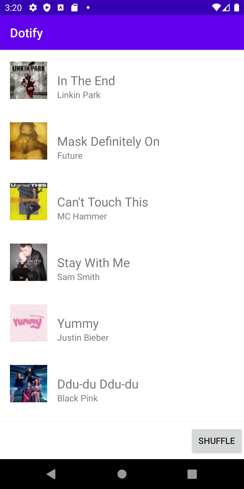
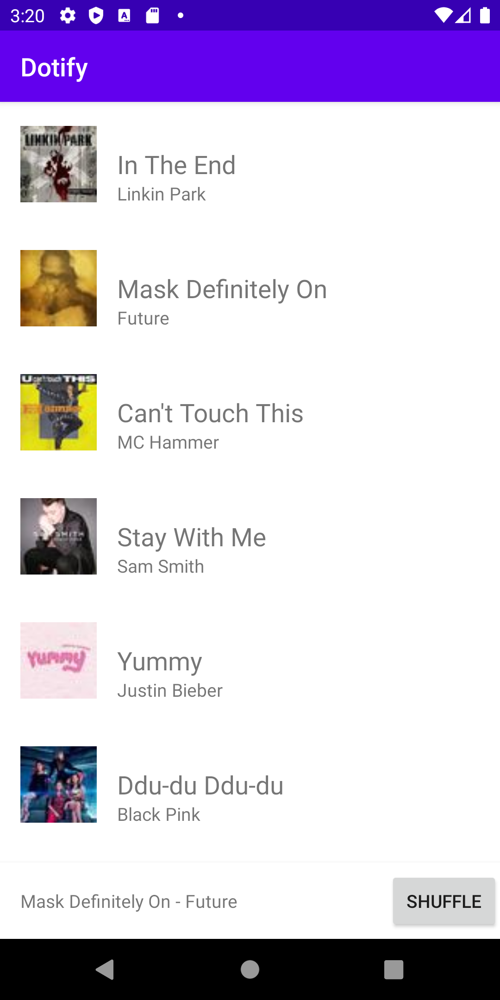
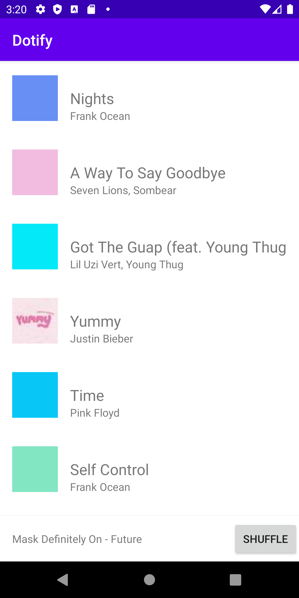
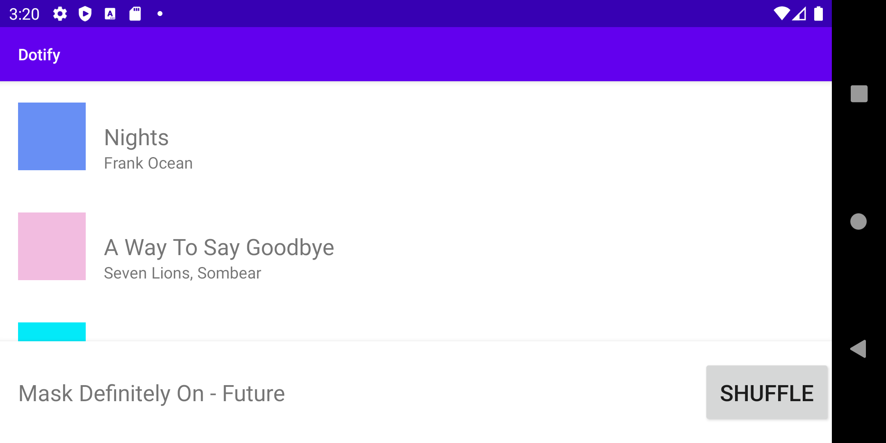
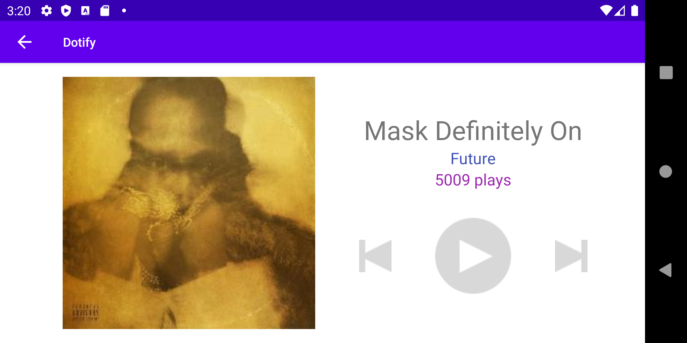
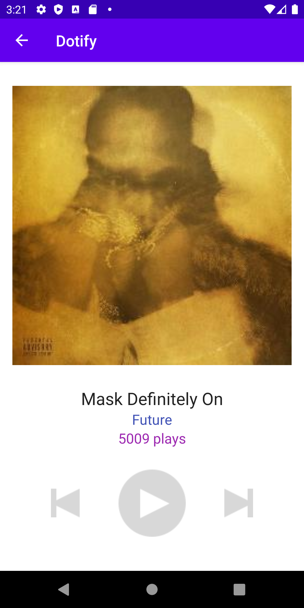
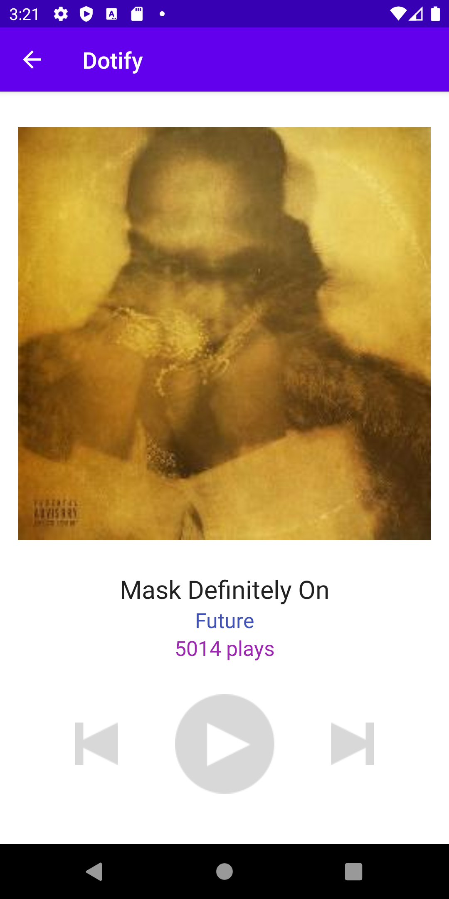

# Dotify - Homework 3
Author: Diana Dai

Date: 4/30/2020

## App Description
Dotify is an Android Music app which users can listen to music on the cloud. It displays a list of songs with a mini player at the bottom. The mini player shows the title and artist that the user has chosen. Users can also shuffle the list of songs with the shuffle button. Once the user has decide on a particular song, they can view more detailed information such as the number of plays on another screen. It supports phone rotation and utilizes fragments.

## Screenshots (emulator)
Default Screen

Select one song

Shuffle the list

Rotation once

Song detail

Rotation second time

Add play num

