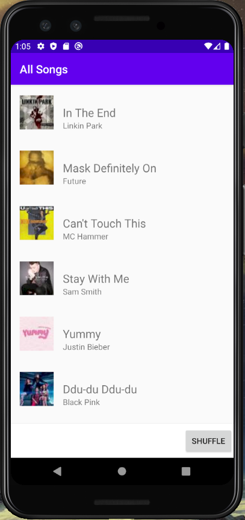
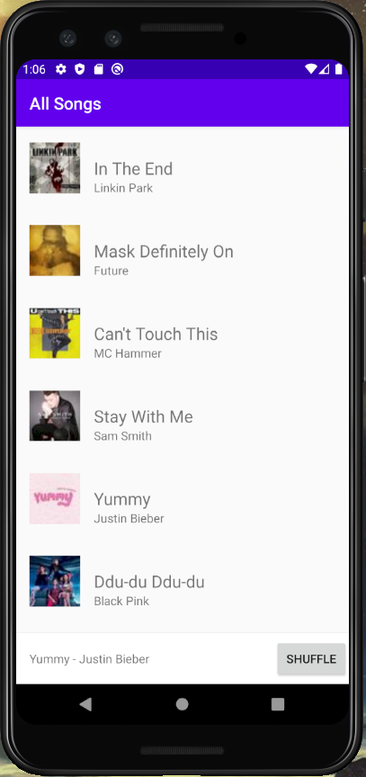
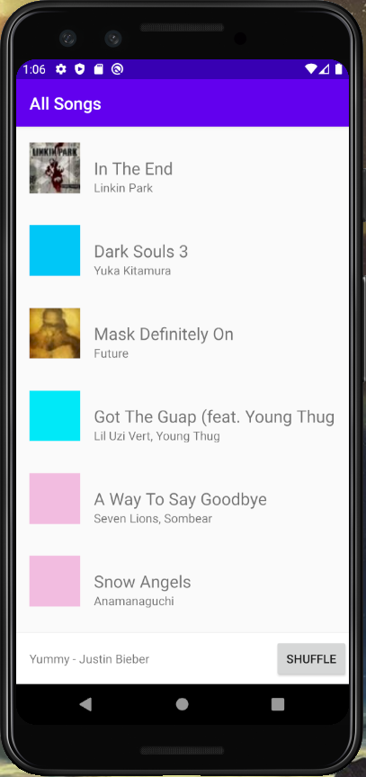
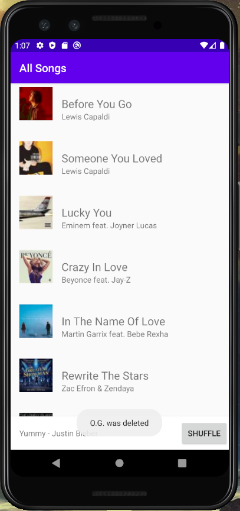
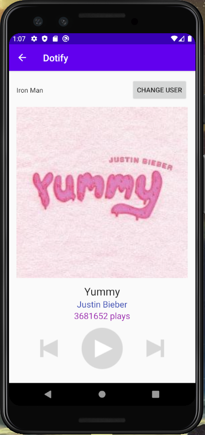

# Dotify - Homework 2
Author: Diana Dai

Date: 4/23/2020

## App Description
Dotify is an Android Music app which users can listen to music on the cloud. It displays a list of songs with a mini player at the bottom. The mini player shows the title and artist that the user has chosen. Users can also shuffle the list of songs with the shuffle button. Once the user has decide on a particular song, they can view more detailed information such as number of plays on another screen.

## Extra Credits Attempted
- Show a stock Android back arrow button, ←, in the Header/Toolbar of Activity B. When clicked, it navigation back to SongListActivity (+.25)
- (+.25) Long pressing on an item should delete that song on the list. It should show a Toast that says what song was deleted.
- When a user presses shuffle, the list should animate the changes using DiffUtil (+1)

## Screenshots (emulator)

Song list view
 

Display song info in the mini player:
 

Shuffle the songs in the song list:
 

Delete a song (when users long click a song)
 

Song play view (when users click the mini player)
